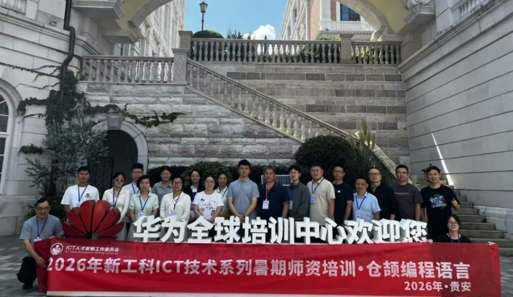
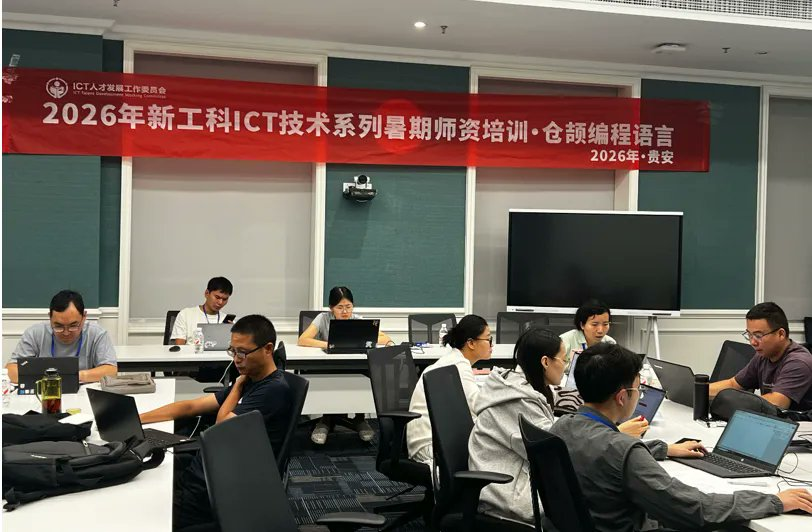
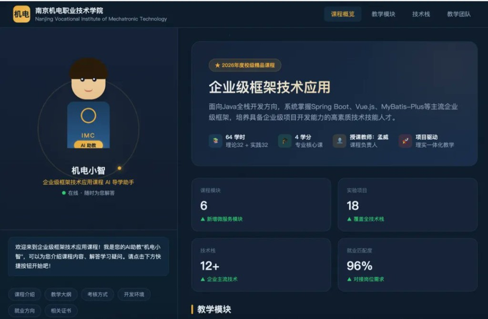
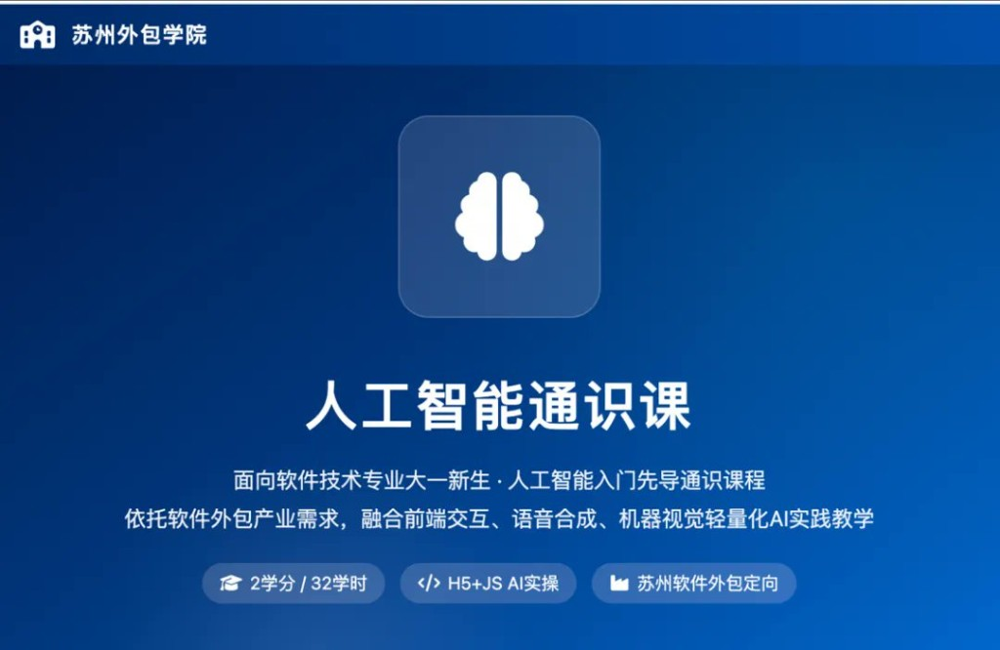
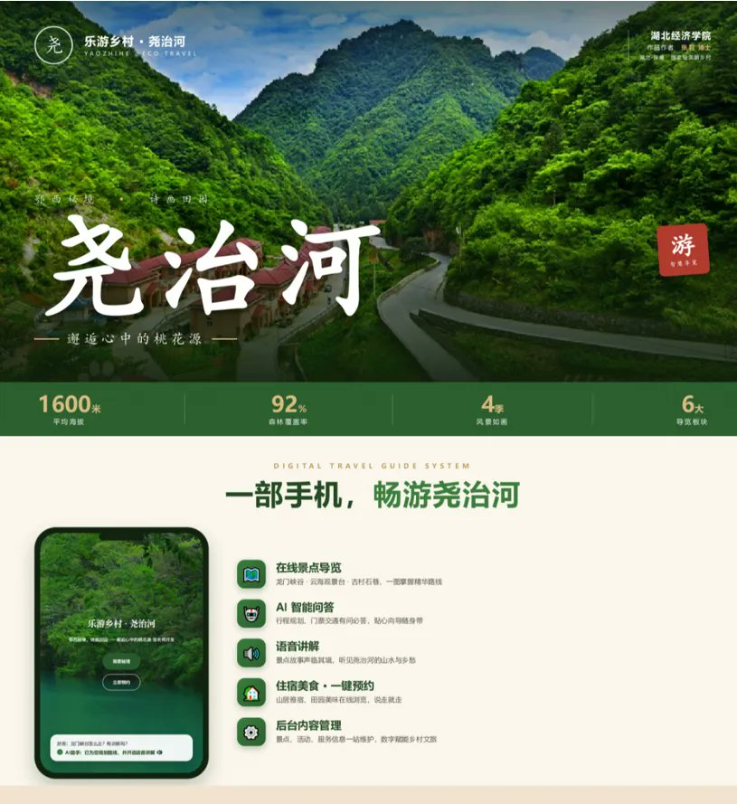
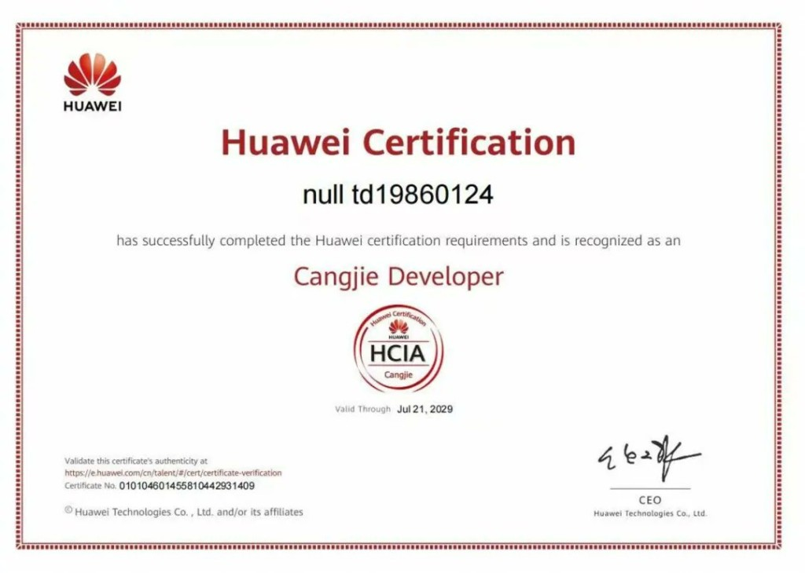

# AI in the Lecture Hall: 22 University Lecturers Build Digital Teaching Assistants with Cangjie

Nearly half of the 22 university lecturers who attended Huawei's three-day Cangjie language training programme in July were not from computer science backgrounds.

That detail matters. The "2026 New Engineering ICT Technology Summer Teacher Training — Cangjie Programming Language," organised by Huawei in partnership with the New Engineering Alliance, a Chinese higher education initiative promoting technology-integrated teaching, was not designed for software engineers. It was designed for lecturers across disciplines who want to bring AI into their classrooms and need the tools to do it.

The 22 participants came from over 20 universities and vocational colleges across China. By the end of three days, each had produced a working AI-enabled teaching application, a Cangjie language completion certificate, and a Huawei HCIA-Cangjie Developer certification.

## Three Days, Structured to Build

The programme progressed from language fundamentals to working deployment. On day one, Xu Yiran, Huawei's Cangjie Ecosystem Manager for university-enterprise collaboration, opened with a talk on Cangjie's application landscape across HarmonyOS, AI, and web services. The curriculum then began: type system and toolchain from an object-oriented perspective, functional programming and pattern matching, classes and inheritance, and collections, IO, and exceptions, with digital media case studies throughout.

Day two moved into web and LLM integration: HTTP server basics, LLM client calls, and full LLM web application assembly. By the end of the day, participants had hands-on experience connecting a large language model to their own program.

Day three was comprehensive practice and HCIA certification preparation. Each participant left with a running project, a course completion certificate, and a Huawei certification.

## What the Lecturers Built: AI Teaching Assistants

The most striking pattern across the projects was the AI teaching assistant, an LLM-backed virtual character capable of delivering lectures and answering student questions around the clock.

Two courses used Cangjie to build frame-driven lip-sync systems for digital avatar characters: the "Object-Oriented Data Structures and Algorithms" course at Xinjiang University of Political Science and Law, and the "Artificial Intelligence Practice Course" at Xiangyang Vocational and Technical University. In both cases, a virtual teacher character speaks and explains course material, driven by the Cangjie application underneath.

A third project went further. Nanjing Vocational Institute of Mechatronic Technology built "Mechanic Little Zhi," an AI teaching assistant for its "Enterprise Framework Technology Application" course. The assistant is available 24 hours a day, 7 days a week for student queries. The course now carries a 96% employment match rate.

The technical architecture is consistent across all three: Cangjie handles web and interaction, the LLM handles content generation, the digital avatar handles visual presentation, and HTTP stitches the three into a working intelligent teaching system. The participants replicated the core capability of commercial virtual presenter products in a few hundred lines of code.

## What the Lecturers Built: Knowledge Bases and Q&A

A second group of projects focused on course-specific knowledge bases and AI-powered tutoring.

Suzhou Outsourcing Institute designed a new "AI General Education Course" for first-year students, integrating lightweight AI practice across frontend interaction, speech synthesis, and computer vision. A Python Programming Design course was equipped with an AI tutoring module across all 8 chapters and 18 units, giving students an always-on assistant for questions. Participants used the Codeway platform to build networked course materials and local knowledge bases, grounding AI tools in specific subject content rather than general-purpose models.

## What the Lecturers Built: Technology for Rural Tourism

The most distinctive project came from Dr. Zhang Li of Hubei University of Economics, School of Business Administration.

Her "Yaozhi River Tourism Navigation System" targets Yaozhi River, a nationally designated scenic village in Baokan County, Hubei Province. A single phone becomes the entry point to online scenic spot navigation, AI-powered Q&A about the area, audio guides for points of interest, and one-tap booking for accommodation and food. The project has already been exhibited at the 2026 Digital Cultural Heritage Conference.

Dr. Zhang's reason for attending: "In recent years, students from non-CS disciplines have developed strong interest in AI programming. I came to understand how to teach and apply domestic programming languages in the digital cultural tourism industry."

## From Zero to Certified in Three Days

The training's outcome is reflected in participant feedback. Tong Dong from Jilin University of Architecture and Technology passed the HCIA-Cangjie Developer certification and said: "Three days of hard work took me from knowing nothing to developing a genuine interest in Cangjie."

The signal the programme sent, in practice, is that a teacher's core competency in the AI era is no longer reciting syntax. It is knowing how to set assignments, make pedagogical judgments, and use AI to lead projects. When more university lecturers can use a domestic language, a large language model, and a digital avatar to rebuild their classrooms, AI and higher education have a much firmer starting point.

## What Comes Next

This training was the first cohort of an industry-education integration project between the Communication University of Zhejiang and Huawei. The lead instructor, Prof. Li Qingsheng, a Huawei Developer Advocate and 2nd-prize winner at the 10th Huawei ICT Competition national finals 2026, noted that Cangjie's use in university teaching is off to a strong start. A second cohort is planned for Q4 2026, focused on teaching applications built on domestic programming languages. Details will be announced by the end of July.
