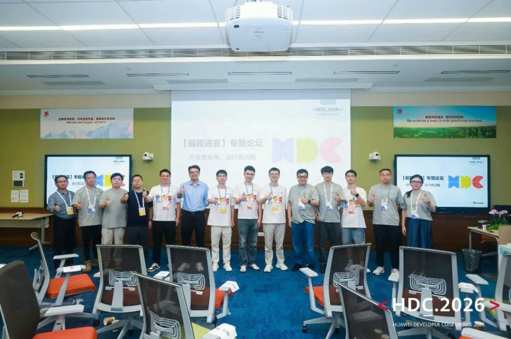
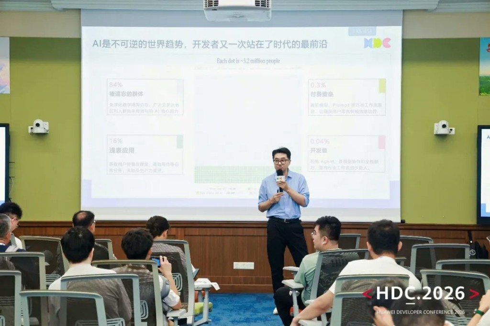
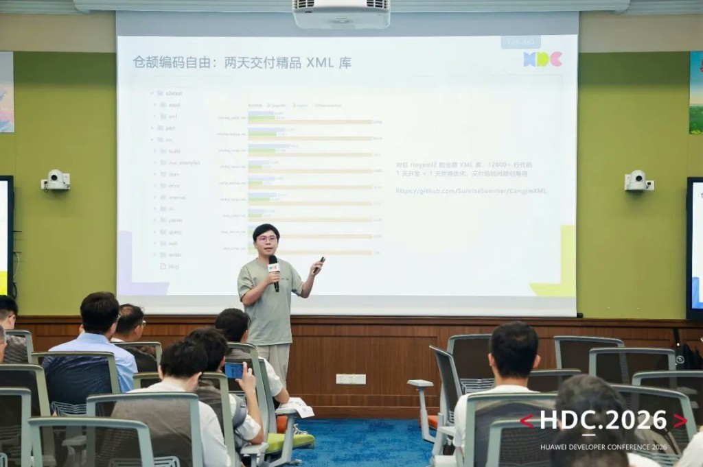

# Cangjie + AI at HDC 2026: Dong Xin and Liu Junjie on the Future of AI-Native Development

Only 0.04% of developers today can truly harness AI at the level that reshapes how software gets built.

That number, presented by Dong Xin, Director of Cangjie's Programming Language Project at Huawei, opened the language forum at HDC 2026 on 13 June. He was joined by Liu Junjie, Cangjie AI Solutions Architect, for a joint session on **"Cangjie + AI: Safe and Efficient Development in the AI-Affinity Language Era."** Together they covered the philosophy, the toolchain, and the concrete results Cangjie has already produced.

## Session 1 — Dong Xin: The Gap and the Paradigm

Dong Xin opened with a breakdown of where developers actually stand with AI today. Around 84% of users have not meaningfully engaged with AI's core capabilities at all. A further 16% use it for surface-level tasks — search, basic writing — without any lasting productivity impact. At the top, a small group has learned to use advanced models, fine-tuned prompting, and multi-agent workflows to break through efficiency boundaries. And at the very peak, only 0.04% of developers are genuinely using agents and full-stack AI collaboration to rebuild how entire industries work.

The barriers are not primarily technical. They are access barriers: expensive frontier models, the expertise required to write effective prompts, and the workflow knowledge that only comes from sustained high-level use. Cangjie's mission, as Dong Xin framed it, is to lower these barriers through language-level design — building the scaffolding for AI collaboration into the language itself, so developers do not need to construct it from scratch.

The paradigm the team has developed since May 2025 is called **Agent Centric Engineering (ACE)**. Rather than positioning AI as an optional writing assistant, ACE embeds agents throughout the entire software lifecycle: requirements analysis, architecture design, coding, testing, and operations. The goal is not to remove the developer but to reposition them toward decisions that require human judgment, while agents handle the repeatable work at each stage.

## Session 2 — Liu Junjie: Toolchain and Results

Liu Junjie presented the tools and real-world outcomes that make the ACE paradigm concrete.

**CangjieSkills** is a full-lifecycle AI skills library for HarmonyOS development in Cangjie. Rather than leaving developers to construct prompts from scratch for every task, CangjieSkills encodes typical development work — UI design, code generation, debug diagnosis, performance optimisation, app migration — as structured, reusable skill units that can be called directly or composed into larger workflows.

**ACE Harness** is the agent productivity framework built on top of CangjieSkills. The Cangjie team is already running it in production: every day, ACE Harness automatically analyses all new issues filed in the Cangjie community, identifies root causes, and outputs structured analysis reports with no human involvement in the loop. From issue detection to diagnosis to report generation, the entire chain runs autonomously.

Both tools are open source:
- CangjieSkills: [https://gitcode.com/Cangjie-SIG/CangjieSkills](https://gitcode.com/Cangjie-SIG/CangjieSkills)
- ACE Harness: [https://gitcode.com/Cangjie-SIG/ACEHarness](https://gitcode.com/Cangjie-SIG/ACEHarness)

### Three Cases in Practice

**Case 1: A production-grade XML library in two days.** One developer, using Cangjie with AI assistance, delivered a Cangjie XML library comparable to tinyxml2 in one day of development plus one day of performance tuning. The result was over 12,000 lines of code, now in commercial use. Open source at [https://github.com/SunriseSummer/CangjieXML](https://github.com/SunriseSummer/CangjieXML).

**Case 2: Programming contests as stress tests.** The Cangjie team has run AI coding competitions with deliberately hard problems to test the language's ceiling. The global finals asked developers to implement Cangjie's own AI coding agent in Cangjie itself — using the language to build its own AI tooling, a genuine bootstrapping challenge. Other problems included implementing a music notation programming language and a Cangjie language subset interpreter.

**Case 3: A full HarmonyOS app from concept to published listing in two months, with 95% of the code AI-generated.** The workflow ran in three stages: AI generated the product concept and visual design; OpenCode and CangjieSkills handled implementation autonomously, with human engineers focused on architecture decisions and quality control; and the final output met native HarmonyOS quality standards, earning a place in HDC's Star Walk showcase.

Two technical details from Case 3 are worth unpacking. For design-to-code conversion, the team uses a dual-granularity alignment strategy: coarse-grained alignment maps design modules to ArkUI (HarmonyOS's UI framework) standard components via the component tree, while fine-grained alignment uses pixel-level screenshot comparison to tune spacing, colour, and layout precision. For debugging, the system closes the loop itself: agents analyse HarmonyOS's hilog output to locate crashes, identify functional gaps, and generate fixes autonomously. The developer only re-enters when a problem requires architectural judgment.

Liu Junjie closed his session with the migration pipeline. For developers moving existing applications to HarmonyOS, the team has standardised the process into five steps: the agent analyses the source project's structure and dependency graph; generates target project scaffolding; runs parallel translation of source code into Cangjie across multiple agents; establishes API mapping rules between the source language and HarmonyOS equivalents; and runs autonomous iterative testing until the output passes acceptance criteria. Work that previously took months now takes days.

Related open source: X2Cangjie (Kotlin to Cangjie) at [https://github.com/SunriseSummer/X2Cangjie/kotlin2cj](https://github.com/SunriseSummer/X2Cangjie/kotlin2cj).

## Looking Ahead

Dong Xin and Liu Junjie closed with a shared question: when AI handles coding, debugging, and documentation, what is the developer's role?

Their answer was specific. The high-value work that remains requires nonlinear thinking, cross-domain insight, and creative judgment — problems that do not reduce to pattern-matching. These domains require the kind of human intuition that AI currently cannot replicate.

Cangjie + AI's stated goal is not to replace developers but to lower the barrier to the infrastructure and skills needed to operate at this higher level. The 0.04% who can work this way today is a starting point, not a ceiling.

Related open source: NonlinearArt at [https://github.com/SunriseSummer/NonlinearArt](https://github.com/SunriseSummer/NonlinearArt).
