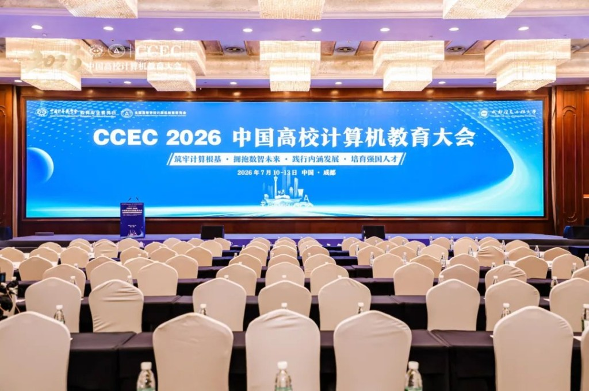
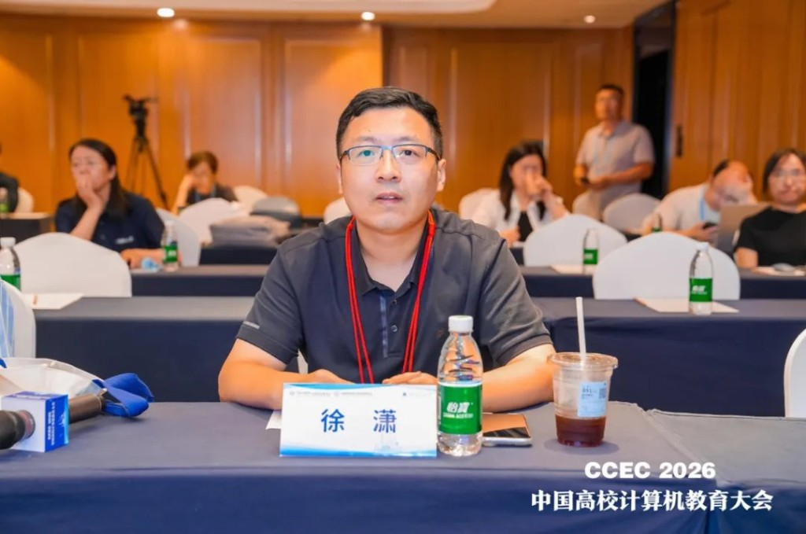
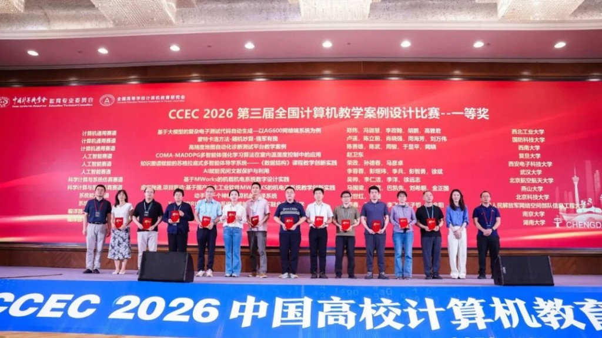
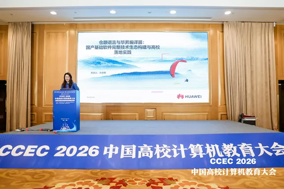

# Cangjie and BiSheng Sweep the PL and Compiler Track at CCEC 2026

421 teaching cases submitted. 121 finalists. 13 awards in the compiler and programming language track, and every one of them went to a case built on Cangjie or BiSheng.

The China Computer Education Conference 2026 (CCEC 2026), organised by the China Computer Federation, was held in Chengdu from 10 to 13 July. Its headline event was the third National Computer Teaching Case Design Competition, where university teachers present and defend the courses they have actually built and taught.

For a programming language, this is a different kind of validation than benchmark numbers. It means teachers chose to build their curriculum around it.

## What Teachers Built with Cangjie

Five Cangjie cases won awards, from Northeastern University, Hefei University of Technology, Wuhan University, Ma'anshan Teachers College, and National University of Defense Technology. What makes them worth looking at is how differently each approaches the language.

One combines AI-driven development with Cangjie to teach full-stack microservices, connecting theory to deployment across the whole chain. Another restructures the traditional compiler principles lab, using Cangjie and the BiSheng compiler as the teaching vehicle. A third guides students through HarmonyOS application development using the MVVM pattern. A fourth uses "build a game from scratch" as the organising principle for an entire course, aiming squarely at creative motivation rather than syntax drills. The fifth has students implement a Turing machine simulator in Cangjie, using a classic computational model to build systems thinking.

Microservices, compiler theory, mobile development, game programming, and theoretical computer science. Five courses, one language.

<small><em>Xu Xiao, Cangjie language expert, serves as a judge.</em></small>

## BiSheng Swept the Top Three

Eight BiSheng-related cases won awards, and teams from Huazhong University of Science and Technology, Nanjing University, and Hunan University took all three first prizes in the track.

Their approaches spanned a full-path compilation pipeline taught in stages, a case pairing Rust with compilation technology, and the integration of AscendNPU IR architecture into coursework. Further cases from Dalian University of Technology, Hefei University of Technology, and others covered compiler optimisation, intermediate representation analysis, and performance tuning toolchains.

The pattern across all of them: BiSheng is being used less as a performance tool and more as a bridge between compiler theory and hands-on engineering.

## Building the Pipeline, Not Just the Cases

The competition was not Cangjie's only presence at the conference. At the forum on virtual teaching and research offices, a Chinese higher education initiative aimed at pooling curriculum resources across institutions, Huawei's Xu Yiran presented on Cangjie and BiSheng as a complete domestic software stack and how it reaches university classrooms.

His talk covered the practical mechanics: joint curriculum development, lab platform construction, teacher training, and industry-academia collaboration. The underlying argument was that award-winning individual cases are the visible output, but the pipeline that produces them — trained teachers with working lab environments and shared course materials — is what determines whether this scales beyond a handful of enthusiastic early adopters.

## Why This Matters

A programming language does not enter a curriculum easily. A lecturer has to rewrite lab materials, retrain themselves, and stake a semester of student outcomes on the choice. Thirteen award-winning cases means thirteen teams decided that was worth doing.

That is a different signal from adoption numbers. It suggests the language is stable enough to teach with, and interesting enough to build a course around.
