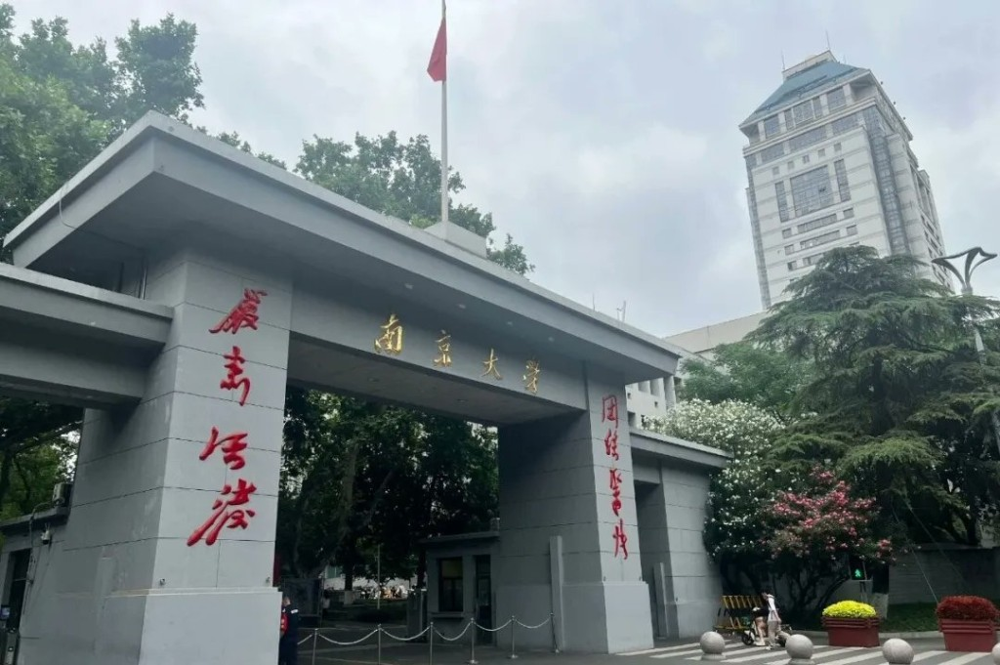
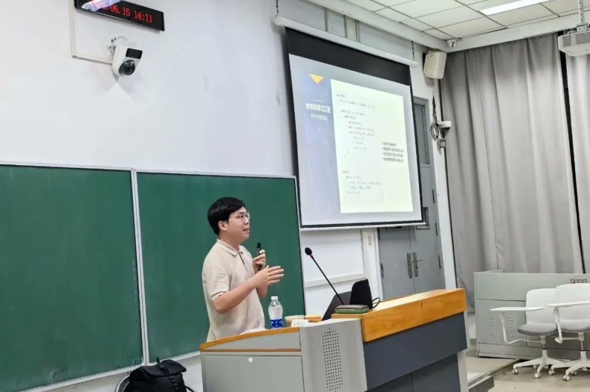
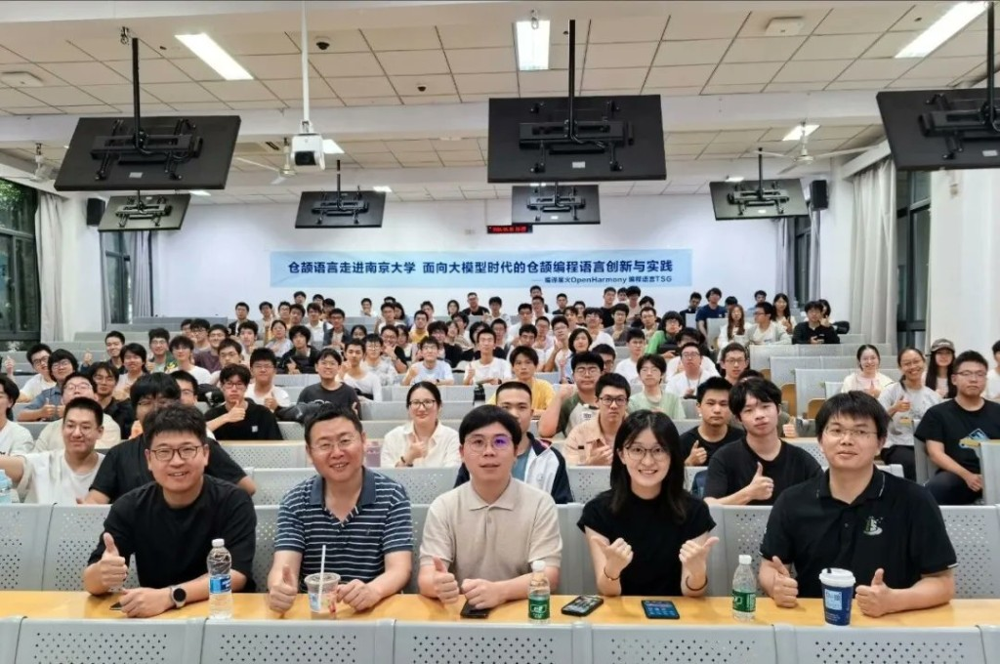

# Cangjie Visits Nanjing University: Programming Language Practice and Innovation in the LLM Era

130 students showed up for a programming language talk the week before finals.

That detail, more than anything else in the recap, captures where Cangjie stands with China's next generation of developers.

On 15 June 2026, the Cangjie team visited the School of Computer Science at Nanjing University (NJU), one of China's leading research universities, to deliver a technical talk titled **"Cangjie Programming Language: Practice and Innovation in the Era of Large Language Models."** The visit fell on the eve of the Dragon Boat Festival public holiday, with the semester exam period already underway. Around 130 students attended regardless.

## What the Talk Covered

The session was presented by Liu Junjie and focused on how Cangjie fits into an AI-native development stack. The team shared progress across five areas.

- **CangjieSkills** is a domain skill library for AI applications, already covering knowledge base construction, code generation, and document processing scenarios.
- **OpenCode for Cangjie** is the language's intelligent code completion and generation toolchain. In certain scenarios, it achieves token utilisation rates around 50% higher than conventional approaches.
- **CangjieXML and CangjieCoder** are an XML parsing library and a JSON parser, both written in Cangjie, demonstrating what high-performance system-level development looks like in the language.
- **ACE Harness** is Cangjie's automated testing and CI/CD platform, designed to support the full development lifecycle.
- **AI-native application prototypes**, built on top of OpenCode and CangjieSkills, showed what UI generation and end-to-end AI application development can look like in practice.

The talk also covered work in progress: a Cangjie knowledge graph, document intelligence tooling, a Skills optimiser, and React Native TurboModule code generation support.

## Community Impact: 100 First-Time Contributors on the Day

Beyond the talk itself, a notable outcome was community growth. Around 100 students followed Cangjie's open-source repositories on GitCode and GitHub during or immediately after the event, representing their first direct engagement with the project. For a language still building its international developer base, a single campus visit converting 100 first-time community members is a meaningful result.

## What Comes Next

The NJU visit is the start of an ongoing partnership rather than a one-off engagement. A Cangjie programming bootcamp is planned for NJU students, covering language features, hands-on projects, and the AI Coding toolchain, with the explicit goal of moving students from initial awareness to sustained contribution.

University engagement is not a side strategy for Cangjie. It is where the next generation of contributors comes from. The numbers from Nanjing suggest the interest is already there.
