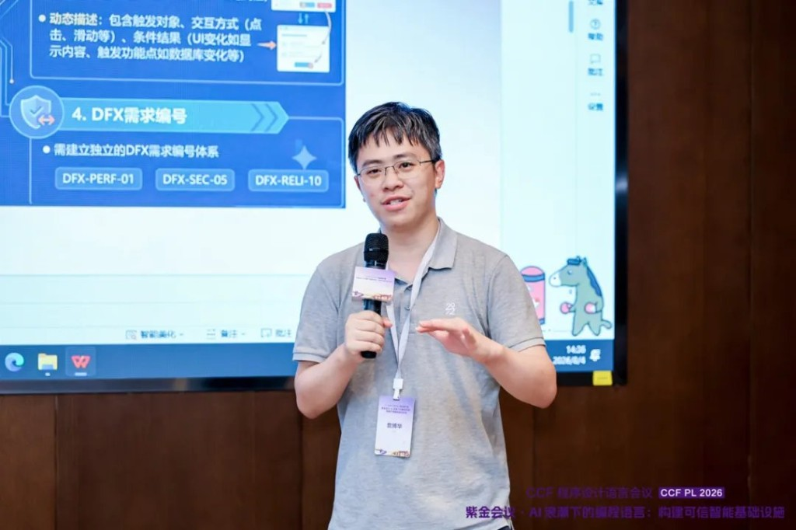
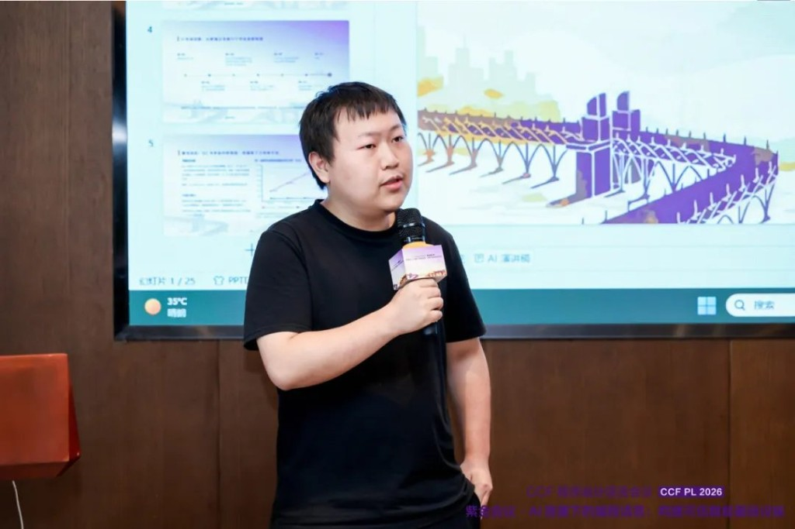
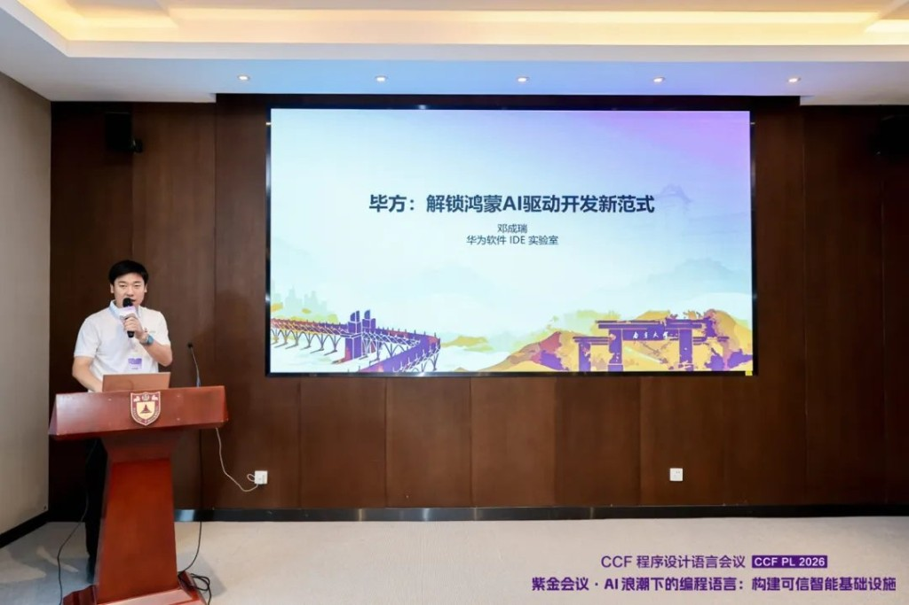
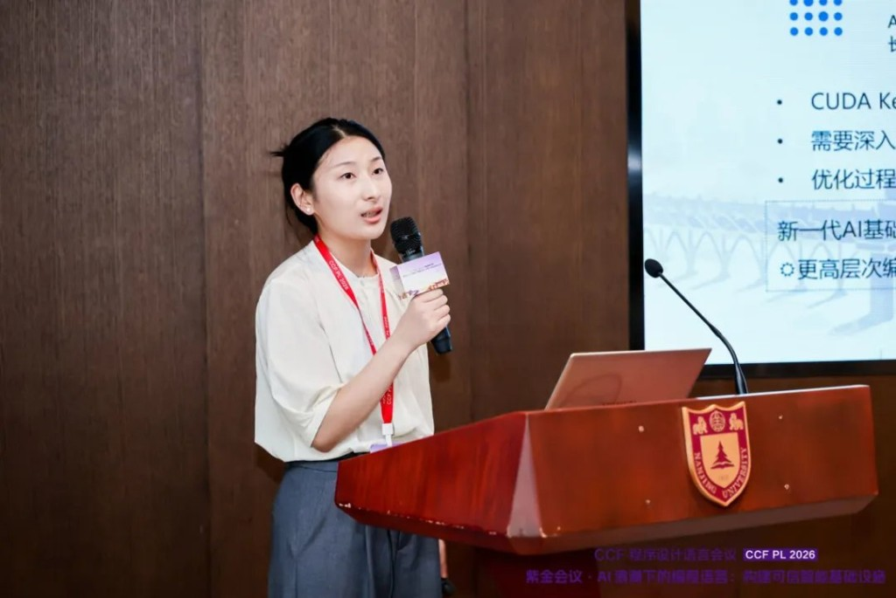

# When the Code Is Written by a Machine, What Should a Language Look Like? CCF PL 2026 Industry Forum

The first CCF Programming Language Conference (CCF PL 2026) was held at Nanjing University on 4 and 5 August, under the theme of building trustworthy intelligent infrastructure in the age of AI. The industry forum on the afternoon of 4 August, chaired by Tu Hong of Huawei's Programming Language Lab, brought together speakers from Huawei, Kaihong, and the Advanced Compiler Lab.

Four talks stood out. Each takes a different position on the same question: what does a programming language need to become when the thing writing the code is not always human?

## 1. CPU Plus LLM as the New Execution Model

Zhan Bohua of Huawei's Programming Language Lab opened with an argument about execution form. Programs no longer run purely on deterministic CPU execution. They run on a combination of CPU and LLM, which means a programming language now has two audiences: human developers and AI agents.

His talk outlined Cangjie's path toward AI affinity along three lines. First, improving the language infrastructure that agents actually depend on: the compiler, the LSP, the testing framework. Second, building a tree-structured AI skills library so agents have organised knowledge to consult rather than reconstructing it from training data. Third, and most interesting, a semi-formal design description language called Speclang, which converts natural language requirements into verifiable specification constraints. The target is the ambiguity problem at the centre of AI coding: an agent that misunderstands intent produces code that compiles and does the wrong thing.

The lab is also exploring a new agent language designed to sit between CPU determinism and LLM flexibility, supporting workflow programming, fine-grained context control, and visualised multi-agent collaboration.

## 2. What Rust Offers an Agent

Li Tao of Kaihong made the case for Rust's specific value in AI-assisted development, using a concrete example: the Bun team migrated 130,000 lines of code from Zig to Rust in 11 days using LLM agents.

The argument is that Rust's guarantees matter more, not less, when an agent is writing the code. Memory safety eliminates roughly 70% of memory-related CVEs. Fearless concurrency removes an entire class of errors that are hard to catch in review. When a human writes code slowly, they catch some of these themselves. When an agent generates code quickly, the language has to catch them instead.

Li Tao's framing of the role shift was direct: developers move from code writers to architects. Humans define boundaries and key design decisions. AI implements. CI and the toolchain close the verification loop.

## 3. AI-Driven Development for HarmonyOS

Deng Chengrui of Huawei's Software IDE Lab presented BitFun, the platform behind HarmonyOS development tooling. Built on an in-house Rust kernel, BitFun powers a HarmonyOS PC version of DevEco Studio, expected for public release in the second half of 2026, alongside two products: DevEco CLI, which exposes atomic tools for agent invocation, and DevEco Code, a full development environment with the Grim 5.1 model built in.

DevEco Code runs in three modes, and the progression between them is the point. Build mode handles small changes through direct conversation. Plan mode automatically decomposes larger features. Goal mode runs specification-driven development end to end, fully autonomously. The self-verification loop currently resolves around 80% of test quality issues without human involvement.

BitFun began open-sourcing components in 2026.

## 4. Compiler Optimisation Across AI Chips

Chai Xiaonan of the Advanced Compiler Lab closed with FlagTree, an enhanced compiler toolkit for multi-chip AI hardware, and its Triton Language Extension (TLE).

TLE provides three levels of abstraction for different users: TLE-Lite is hardware-agnostic, aimed at algorithm engineers; TLE-Struct is architecture-aware, for performance engineers; TLE-Raw exposes hardware-native semantics for specialists. By introducing structured tile operation primitives such as `extract_tile`, TLE delivers 1.10x to 1.37x improvement on typical operators, with up to 83x speedup on core operators, and supports optimise-once-deploy-across-chips on seven chip platforms.

Chai also covered work on redundant instruction elimination, intermediate buffer optimisation, and neural-network-based JIT auto-tuning, which reduces JIT compilation time by a factor of 4 to 6.

Across all four talks, the same shift appears from different angles: language design, compiler optimisation, and developer tooling are each being reshaped by AI, and each is converging on the same requirement. The language has to be legible to a machine that is writing in it.
