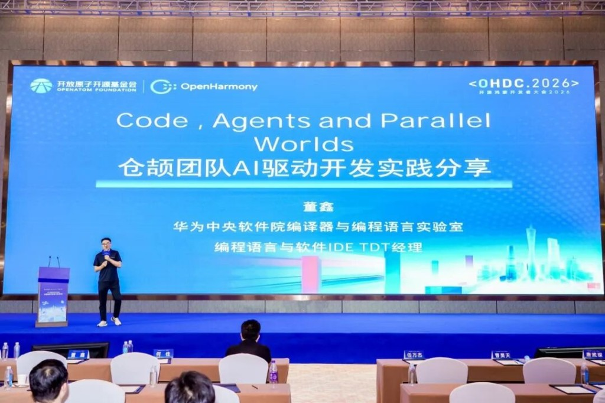
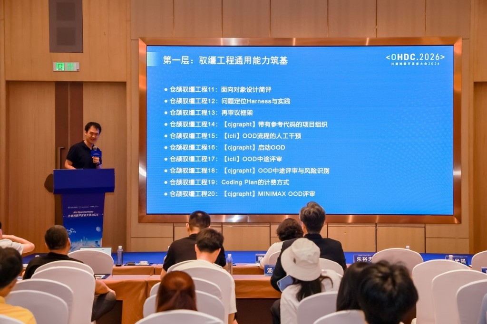

# Code, Agents, and the Next Generation of Developers: OHDC 2026 Recap

On 28 May 2026, the OpenHarmony Developer Conference (OHDC 2026) convened in Guangzhou under the theme **AI @ OpenHarmony**. Researchers, engineers, and educators from Huawei, universities, and ecosystem partners gathered to examine what AI-driven development actually looks like in practice, not on a roadmap, but in production teams and university classrooms today.

Two sessions from the conference stood out for their depth and practical grounding: @SeanXDO Sean Dong's talk on Agent Centric Engineering in the AI Forum, and Prof. Zhang Yin's presentation on AI-native Cangjie education in the Talent Development Forum.

## Sean Dong: Code, Agents and Parallel Worlds

Sean Dong, Programme Director at Huawei's Central Software Institute and leader of the Cangjie Programming Language team, opened his talk with a hard look at where AI capability is actually distributed. Only 0.04% of people, he noted, are using advanced agent technology to reshape entire workflows. The remaining 84% are still at the surface level.

The core of his talk was the **ACE model (Agent Centric Engineering)**, a development paradigm built around the idea that the engineer's role has fundamentally changed. Under ACE, engineers are no longer the primary code writers. They are directors and architects: defining intent, decomposing tasks, orchestrating workflow, and owning quality. The AI agents are the ones on stage.

Those agents operate across three tiers. **Lead agents** handle core feature development. **Supporting agents** take on auxiliary coding. **Background agents** run batch testing and log analysis. The model isn't metaphorical; it maps directly to how work is actually divided inside Cangjie teams.

The productivity data he presented came from real projects over 300 days:

- **Syntax adaptation task:** 2600% efficiency gain (1.3K LOC, 0.1 person-months)
- **Markdown validation black-box testing:** 816%
- **CHIR serialization/deserialization:** 240%
- **FastKit library work:** 125%
- **Third-party library team throughput:** up from 1.1K LOC/person-month to 3–5K LOC/person-month, a 300–500% improvement

These aren't cherry-picked outliers; they span different team types and task categories.

On the technical side, Dong offered one of the clearest frameworks I've seen for understanding why the AI tooling stack has evolved the way it has. His starting premise: a large language model is a probabilistic system with no persistent memory, working only from what's currently in context. Every tool and technique in the modern AI stack (Prompt engineering, RAG, Function Calling, MCP, Workflow, Skill abstraction) exists for the same underlying reason: to compensate for what the model structurally cannot hold on its own.

He mapped this out across five layers:

- **Prompt / Context / Memory:** keeping conversation history alive by repeatedly feeding it back in
- **RAG / Search:** attaching an updatable external knowledge store for information that doesn't fit in context
- **Function Calling / MCP:** converting natural language intent into structured, machine-parseable instructions so tool calls don't fail on ambiguity
- **Workflow / LangChain / Skill:** encoding accumulated experience into reusable, agent-readable procedures, preventing workflow drift
- **SubAgent / Harness / State Machine:** elevating task state to system-level control, so that long-running tasks aren't polluted by accumulated errors in context

Each layer is, in essence, a different way of giving memory, structure, and control back to a system that has none of those natively.

Dong closed with a formula for AI-era engineering productivity: **ACE Effectiveness = Creative Drive (C) × Iteration Speed (I) × Verification Efficiency (V)**. His point: when execution capacity becomes effectively unlimited, judgment becomes the scarce resource. He also flagged five risks that tend to get glossed over in the efficiency narrative: lack of genuine innovation, hallucination control, the difficulty of verification at scale, security exposure, and accountability gaps. Human review and fallback mechanisms, he argued, are not optional.

## Prof. Yin Zhang: Teaching Cangjie in the Age of AI

Yin Zhang, Associate Professor at Northeastern University's School of Software and a Huawei Developer Advocate, approached the same transformation from the education side, and the parallels with Dong's framing were striking.

His diagnosis of what AI is doing to software education was direct: the capability model built around code fluency is breaking down. Syntax memorization, API recall, and repetitive coding are declining in relevance. What's rising, sharply, is the ability to design systems, write effective prompts, verify AI output, and decompose complex requirements.

The most conceptually interesting part of his talk was what he called **Inverted Learning (倒置学习)**, framed as a direct analogy to Inversion of Control in software engineering. In traditional teaching, students manually instantiate each piece of syntax knowledge and manage the dependencies between concepts themselves, often drowning in initialization detail before they've seen any business value. In Inverted Learning, the AI acts as the cognitive container: students declare intent via prompt, the AI handles instantiation, and the learner's attention shifts to interface contracts and output quality verification.

The analogy is precise, not decorative. If we've already accepted IoC in production software (you don't manually manage dependencies, you declare them and let the container resolve them), then forcing students to manually manage every syntax detail, rather than declaring intent and having AI implement it, is a paradigm mismatch with how software is actually written.

Zhang's curriculum translates this into a three-layer progression:

- **Layer 1: AI-Directed Engineering Foundations (25% of course time)** — Language-agnostic. Covers core methodology for working with AI: expressing development intent, setting code constraints, and validating AI output. Designed for rapid onboarding regardless of prior background.
- **Layer 2: Cangjie Language Depth (50%)** — Syntax comes second, not first. Students work on real tasks (CLI tools, graph algorithms) and build language understanding by dissecting AI-generated code, debugging it, and refining the prompts that produced it. Language comprehension through reversal.
- **Layer 3: Open-Source Contribution Practice (25%)** — Real community needs, real deliverables. Student teams complete full ACE-directed development cycles, and strong outputs are submitted for inclusion in the Cangjie ecosystem library.

The material infrastructure he's built, including structured knowledge bases, prompt templates, lightweight validation toolkits, and a full standardized teaching package, is designed for portability. Other institutions can adopt it without modification. The goal is propagation across the New Engineering Alliance and the Cangjie ecosystem.

On faculty development, he was candid: teachers need retraining. The role shift from knowledge deliverer to practice facilitator is real, and it doesn't happen automatically. Differentiated learning paths for students at different entry levels are also necessary if the curriculum is to work beyond controlled conditions.

## A Note on the Two Talks Together

Dong and Zhang weren't coordinating their presentations, but the two talks fit together more neatly than most conference sessions manage. Dong showed what the productivity ceiling looks like when experienced engineers run AI-directed workflows at scale. Zhang showed how to build the next generation of engineers who can operate at that level from day one.

The shared premise is the same: execution is no longer the bottleneck. Intent, judgment, and verification are. The gap between those who understand that and those who don't is the real digital divide Dong's opening numbers were pointing to.
