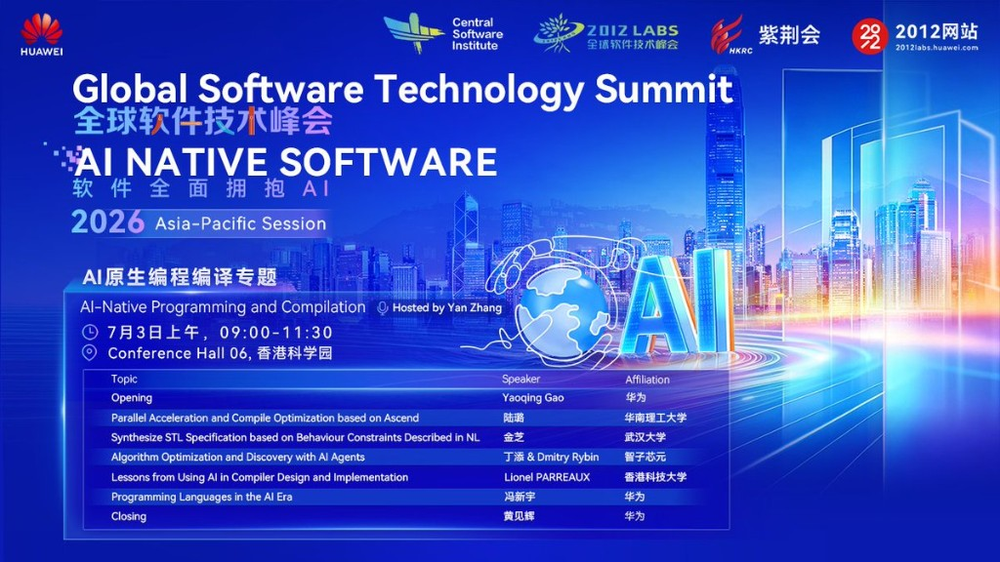
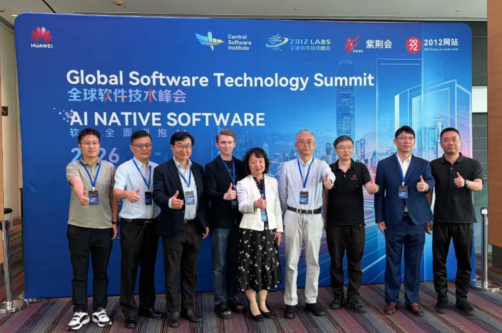
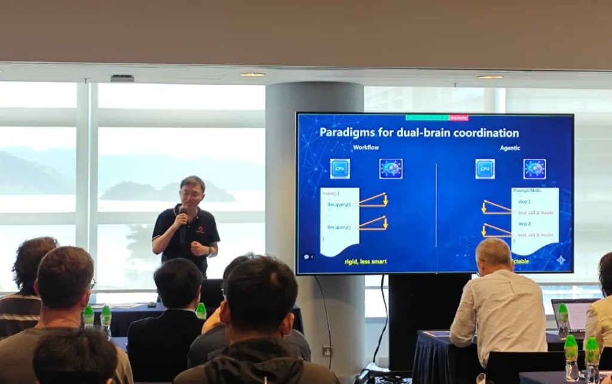
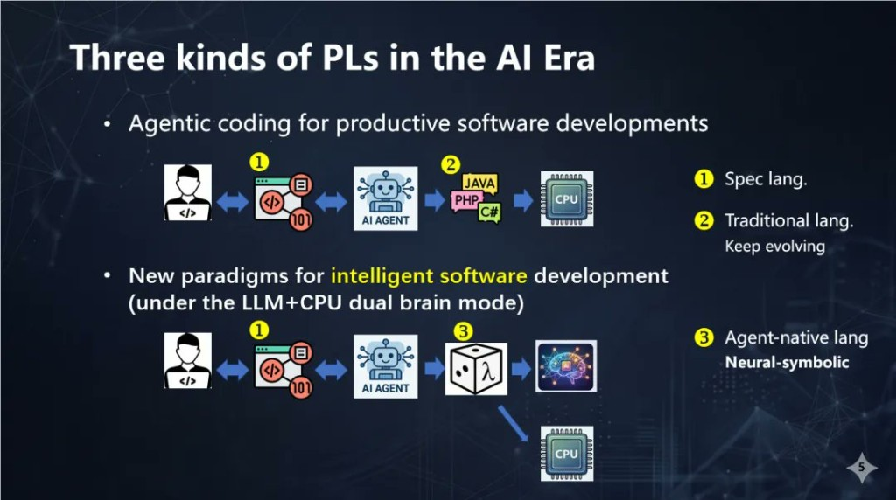
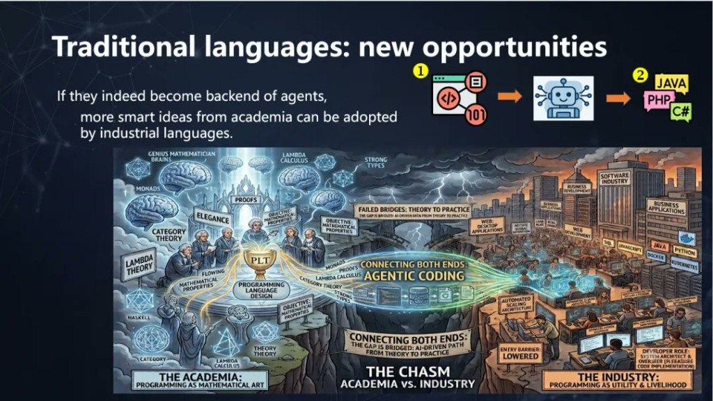
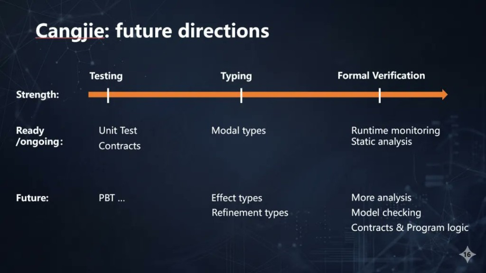

# GSTS 2026 Asia-Pacific Session: Programming Languages in the AI Era, a New Paradigm

***Will programming languages disappear in the AI era?***

That was the question Prof. Feng Xinyu posed to open his keynote at the 2026 Global Software Technology Summit (GSTS) Asia-Pacific Session, held at Hong Kong Science Park on 3 July. The answer he developed was not a reassurance. It was a detailed framework for how programming languages must change.

The session was part of the **"AI-Native Programming and Compilation"** track, which brought together researchers and engineers from Huawei, South China University of Technology, Wuhan University, Zhizi Xinyuan, and HKUST to explore the direction of programming language and compiler technology in the AI era. Hosted by Yan Zhang, the track attracted hundreds of developers and technical decision-makers.

## The Dual-Brain Shift

Prof. Feng Xinyu, affiliated with Huawei's Compiler and Programming Language Lab and Nanjing University, opened by reframing what is actually changing. The shift is not just that AI tools are available. It is that the computing model itself has transformed. Traditional systems ran on deterministic CPU-based symbolic computation. The emerging model combines LLM-based neural networks with CPU-based symbolic computation in what he called the **"dual-brain" cooperative mode**.

This has implications at every level. End users are no longer purely human; they operate as "human + Agent." Developers are no longer purely human either. The fundamental design question for programming languages therefore changes: how do you balance randomness and determinism? How do you use formal methods to ensure that intelligent software delivers reliable business outcomes?

## Three Kinds of Programming Languages in the AI Era

From this foundation, Prof. Feng proposed a framework for how programming languages evolve. He identified three distinct types.

**The first is Spec Languages.** Facing the inherent ambiguity of natural language as a means of specifying requirements, he reached back to Turing Award laureate Dijkstra's 1978 essay and its argument against natural language programming. The response he proposed is Specification-Driven Development (SDD): formal specifications that serve as ground truth, verified by tooling to ensure consistency with the code. Spec languages, he argued, will develop their own rigour spectrum analogous to the dynamic-to-static range in type systems, becoming critical infrastructure for AI-era software development.

**The second is the continued evolution of traditional languages.** Prof. Feng's argument here was specific: traditional languages will not disappear but will shift roles, becoming the IR (intermediate representation) backend for agents, with greater emphasis on correctness and performance rather than usability. He used Rust's type system to illustrate how formal methods' value in industrial languages will grow. He also presented Cangjie's concrete results in Agentic Coding support: through the Cangjie Harness framework, real business scenarios have achieved up to 90% AI code generation rates and over 90% migration success rates, supporting the case that a newer language can leverage infrastructure advantages to close the gap with established ones quickly.

**The third is Agent-Native Languages**, the most forward-looking category. Prof. Feng identified a core problem with existing frameworks: Workflow-based approaches are too rigid; current Agentic frameworks are too unpredictable. His proposed solution is an "Agent as Code" paradigm that expresses agents directly in code, enabling fine-grained LLM-CPU interaction. The theoretical underpinning is a unified framework based on **Algebraic Effects**: Agent = Model + Harness, with LLMs modelled as mappings from Prompt/Context to Text/Context+Effect, tool calls treated as controlled effects, and semantic types and probability branching as native language-level abstractions. This provides a foundation for building agent programming languages that are predictable, safe, and token-efficient.

## Cangjie's Roadmap

Closing his talk, Prof. Feng sketched Cangjie's evolution trajectory for the AI era. The roadmap covers testing (Contracts and Property-Based Testing), type system extensions (Modal Types, Effect Types, and Refinement Types), and formal verification (Model Checking, Runtime Monitoring, and Program Logic). It is a systematic long-term positioning of an industrial language in the AI-native direction.

## The Rest of the Track

Beyond Prof. Feng's keynote, the track included four further talks. Lu Lu from South China University of Technology shared parallel acceleration and compile optimisation practice on Ascend. Jin Zhi from Wuhan University presented a technical approach for synthesising Signal Temporal Logic (STL) specifications from natural language behavioural constraints. Ding Tian and Dmitry Rybin from Zhizi Xinyuan demonstrated AI Agent applications in algorithm optimisation and discovery. Lionel Parreaux from HKUST shared practical lessons from applying AI to compiler design and implementation. Yaoqing Gao from Huawei gave the opening remarks and Huang Jianhui the closing.

## After the Talks

Discussion continued in the venue after the formal sessions, with attendees engaging on the design boundaries of AI-native programming languages, formal verification, and the feasibility of large-scale industrial deployment. The Cangjie exhibition poster attracted sustained attention from academic visitors, prompting detailed conversations with the Huawei team about Agentic Coding support and Cangjie Harness results.

Prof. Feng's closing line served as the session's thesis: "Formal languages are our friends, not enemies." In the AI era, programming languages do not fade. They become more rigorous, more intelligent, and more native to the systems they describe, serving as the bridge between human intent and computational execution.
