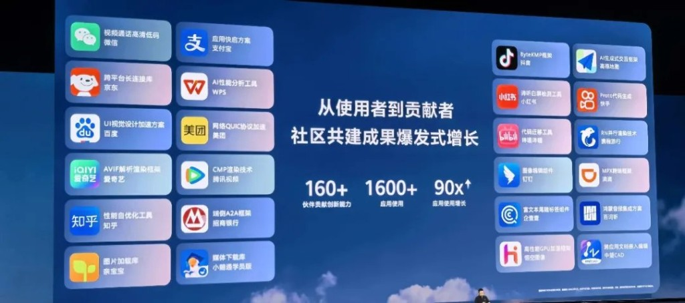

# HDC 2026 Day One: Cangjie Fires on Three Fronts: AI Stack, Accessibility, and Partner Upgrades

Cangjie's AI stack is going open source.

That was the headline from HDC 2026, but the full picture from Dongguan this week was bigger than any single announcement. At the keynote of Huawei Developer Conference 2026 (12–14 June, Songshan Lake), the Cangjie programming language team took the stage with three releases that together span the full range of what a language can do: infrastructure for AI-native development, accessibility tools that give a hearing-impaired delivery rider a voice, and performance upgrades that make apps feel instant.

## 1. The AI Stack Is Opening Up

Gong Ti, President of Software at Huawei Terminal BG, confirmed in his keynote address that Cangjie's AI technology stack will be fully open-sourced in 2026. The stack covers three layers:

- **Agent DSL** — a domain-specific language for building intelligent agents
- **ACE Harness** — an engineering suite for AI-native application development
- **Skills library** — a curated component set for smart-app scenarios

Some context: Cangjie launched as a preview in 2024, opened its core language in 2025, and is now opening the AI layer in 2026. For developers building on HarmonyOS, this completes an open-source chain from language runtime all the way up to agentic intelligence, with no proprietary lock-in at the AI tier.

## 2. One Line of Code, One Act of Care

The most human moment of the keynote came from a delivery app.

Meituan Crowdsourcing, China's leading on-demand delivery platform, debuted its HarmonyOS version built entirely in Cangjie. The app ships with an accessibility suite designed for hearing-impaired riders, directly addressing what the team described as the "can't hear, can't speak, slow to communicate" problem in last-mile fulfilment.

Two carefully built flows make this work. When a rider needs to reach a customer, the IM interface provides preset message templates. Combined with fast-input and an on-device large model, the app generates contextual messages based on live order status and converts them to voice output for the customer, dramatically reducing the communication burden on the rider. In the other direction, incoming customer voice messages are transcribed in real time and displayed as text in the rider's IM view, so a hearing-impaired rider can read and respond immediately.

The tagline on stage was **"一行代码，一声关怀"**: one line of code, one act of care. It earned it.

## 3. Partner Experience, Levelled Up

Two more partner stories rounded out the Cangjie keynote segment.

Meituan Crowdsourcing also showcased spatial audio navigation. Using Cangjie's Audio Kit, the HarmonyOS app implements spatial audio for turn-by-turn directions. As a rider moves through traffic, navigation cues shift dynamically in 3D space to match their heading, so riders can sense a turn without glancing at a screen: safer riding, more immersive experience.

iQIYI, one of China's largest video streaming platforms, integrated Cangjie's AVIF image library into its HarmonyOS app, achieving a significant reduction in homepage load time. Open the app, content is already there.

---

The Cangjie story at HDC 2026 was ultimately about range.

A language that can scaffold an AI agent framework. A language that can give a hearing-impaired rider a voice. A language that trims milliseconds off a first-screen load and makes road navigation safer.

From AI-native infrastructure to human-centred accessibility, the message from Dongguan was clear: good language design is not just about what runs fast. It's about what gets close enough to matter.

