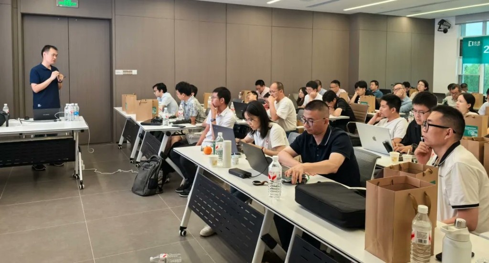
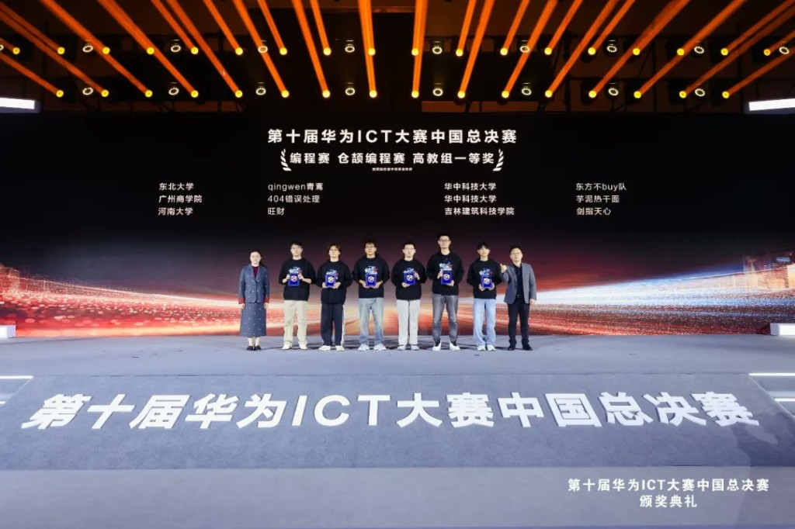

# If AI Can Write Code, Does a New Language Still Matter? Meet Cangjie's First Developer Advocate

Zhang Yin has been writing code since 2002. Over 24 years, he built his mental model of software development around C#, .NET, Visual Studio, and the open-source communities that grew up around them. He teaches at Northeastern University's School of Software in Shenyang, China, and describes himself, only half joking, as less of an educator and more of "a seasoned programmer who loves tinkering with new things."

When he first heard about Cangjie, a new programming language developed by Huawei, his motivation was straightforward: "I'd always thought, when will China have a new language I can try?" Nothing more than that. A veteran developer's curiosity, the desire to try a different tool after years with the same set. What he found after actually picking it up was that the project was more interesting than he expected.

Zhang Yin is the first Huawei Developer Advocate for Cangjie. The role gave his years of experience in technical communication a clearer direction: take a new language and a new ecosystem, make it legible to more developers, and build the bridge between classroom, community, and real engineering practice.

## Why AI Raised the Stakes for Language Design

Since April this year, Zhang Yin has switched almost entirely to AI-driven development. The shift sharpened his view of what matters in a programming language.

When AI participates heavily in writing code, the "AI-friendliness" of a language becomes critical in ways it wasn't before. Compilers need to be fast. Error messages need to be direct. Problem localization needs to be precise. In the past, if compilation was slow, a developer could go make a cup of coffee. Now AI is looping through compile-run-fix cycles continuously; every wasted second is a hit to efficiency and token cost.

This has not made programming languages obsolete. It has done the opposite: it has elevated the importance of the engineering foundation underneath them. Performance, type system clarity, standard library completeness — all of these affect how well AI can understand, generate, and migrate code. For a new language like Cangjie, Zhang Yin sees an opportunity: AI can help it absorb the best ideas from mature ecosystems faster than would otherwise be possible. The precondition is a stable toolchain, clean language design, and a solid enough ecosystem base to build on.

## The Appeal of a Young Language

One of the things Zhang Yin values most about Cangjie is its age.

Mature languages have full ecosystems, rich documentation, and well-trodden pitfalls. The problem is that in a mature ecosystem, the available positions for contributors are largely taken. Making a visible impact is hard. Cangjie is different. He compares it to a city still under construction: many roads not yet paved, many buildings not yet built, but precisely because of that, opportunity is everywhere.

The Cangjie community already reflects this. Developers arrive from Go, Java, and .NET backgrounds, each bringing the best practices they have accumulated elsewhere. The resulting discussions can get heated, but Zhang Yin sees that as valuable. A new ecosystem carries no historical baggage. It can take ideas already validated in mature settings and rebuild them with newer approaches. That is the late-mover advantage.

This is where he sees the developer advocate role as genuinely important. New languages and new ecosystems cannot grow purely from official documentation. They need people willing to go in first, stumble around, explain what they found, and bring others along. Zhang Yin is happy to be that person. He calls himself "the one who runs in to scout the terrain."

## Cangjie in the Classroom

For Zhang Yin, the role extends naturally into his teaching. His goal is not simply to swap one language for another in his courses. It is to use Cangjie as a thread that connects multiple computer science and software engineering subjects.

He was drawn to C# partly because of its full-scenario capability: one language that could be used to teach compilers, memory management, networking, and data structures. He sees Cangjie offering a similar opportunity. A language with a compiler, runtime, standard library, and third-party library ecosystem can be the vehicle for teaching compiler principles, memory allocation, TCP/UDP, and data structures, giving students a single modern codebase through which to understand how contemporary software systems actually work.

He has already started. His "Microservices Architecture and Design Patterns" course switched to Cangjie last year, integrating virtualised environments, container compilation, middleware, and complete development workflows. "Full-Stack Development Technology" is planned for more Cangjie content. "Industrial IoT Development Technology" has added Ascend operator development. This year, a student team he mentored built a HarmonyOS app in Cangjie and won first prize in the Cangjie programming track at the 10th Huawei ICT Competition China National Finals 2026.

On whether AI makes foundational courses less important, he takes the opposite view. In the AI era, he argues, basics become more important, not less. The person who truly uses AI well is not someone who dumps requirements into a tool and waits. It is someone who uses professional knowledge to better prompt AI, getting higher-quality outputs in return. Open assignments should be judged not by whether students used AI, but by what they managed to do with it: creative ideas, complex problem-solving, better proposals.

## Teaching Beyond the Classroom

Beyond his university courses, Zhang Yin publishes free teaching videos on Bilibili, China's major platform for technical content, covering Cangjie, Ascend, and related topics. His philosophy is simple: if something is interesting, do it; if course content can be shared at low cost, share it.

He mentioned a moment that stayed with him. A "cyber classmate" — a high school student who had been watching his .NET tutorials for years — eventually joined the Cangjie community and earned recognition as a contributor to the Cangjie 1.1.0 beta test. For Zhang Yin, that is the most interesting thing about technical content creation: you never know who is on the other side of the screen, or which video will matter to them, but the possibility is always there.

His closing advice: "AI hasn't reduced opportunities for developers. It has increased possibilities. Keep your passion and spirit of exploration."

From .NET to Cangjie, from traditional classroom to AI-driven development, from video creator to developer advocate, the pattern has been consistent. See something new, try it. Figure it out, then explain it to more people.
