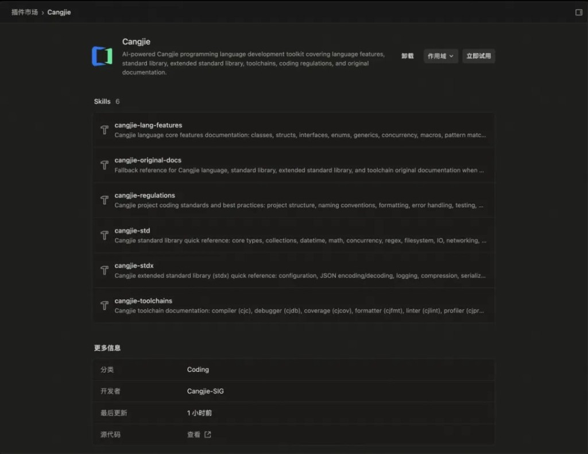

# New Plugin: A Cangjie Toolkit for HarmonyOS Developers

Ask an AI agent to write concurrent Cangjie code and it will probably give you Java. Threads, thread pools, the whole familiar pattern. The code looks plausible. Then `cjc` fails to compile it.

This is the practical problem with any new language in the LLM era, and it is the problem the new Cangjie plugin for Qoder Desktop is built to solve.

## Why This Matters for a New Language

Cangjie is Huawei's next-generation programming language, released in June 2024, targeting HarmonyOS NEXT native applications and server-side development with a focus on native intelligence, high performance, and strong safety guarantees.

The issue is that Cangjie is young. There is very little Cangjie code in LLM training corpora. When an agent writes Cangjie, it confuses syntax, invents APIs that do not exist, and gets toolchain commands wrong. The output reads convincingly and then fails at compile time.

The concurrency example is the clearest illustration. Cangjie does not use Java's threading model. The correct approach is `spawn` to launch a lightweight thread, `Future` to retrieve results, and atomic types or `synchronized` to protect shared state. An agent working from Java intuition will either produce code that does not compile, or code that runs but is not idiomatic Cangjie.

The plugin's answer is not to make the agent guess better. It is to give the agent the official documentation to consult, organised into six Agent Skills covering over 570 documents in total.

## 6 Skills Covering the Entire Cangjie Development Lifecycle

1. **cangjie-lang-features** covers core language features across 24 topics: classes, structs, interfaces, enums, generics, concurrency, macros, pattern matching, error handling, and CFFI interop. Macros and CFFI, both common sources of mistakes, get dedicated chapters.

2. **cangjie-std** is a standard library quick reference across 27 modules: collections, IO, filesystem, networking, regex, concurrency, reflection, and the unit testing framework.

3. **cangjie-stdx** covers the extended standard library: JSON encoding and decoding, HTTP client and server, WebSocket, TLS, logging, compression, serialisation, and cryptographic algorithms including RSA, SM2, and SM3.

4. **cangjie-toolchains** documents the toolchain: `cjc` (compiler), `cjpm` (package management), `cjdb` (debugger), `cjcov` (coverage), `cjfmt` (formatting), `cjlint` (static analysis), and `cjprof` (profiling).

5. **cangjie-regulations** covers coding standards and best practices for project structure, naming, error handling, testing, concurrency, and security, giving team projects a shared reference point.

6. **cangjie-original-docs** is the fallback. When the first five Skills do not cover a query, the agent falls back to searching the complete official documentation library. This one runs as an internal knowledge base and does not appear in the menu.

None of these need to be invoked manually. Once the plugin is installed, the agent decides which documentation to consult when you write Cangjie code or ask a Cangjie question.

## How to Install and Verify It Works

Open Qoder, go to the Quest window, find the Plugin Marketplace in the left panel, search for Cangjie, and install.

To check it is working, try a prompt like:

> Write a concurrent utility in Cangjie that calls multiple APIs simultaneously, aggregates all results, and gives a clear error if any single call fails.

Then read the output. If it uses `spawn` and `Future` rather than Java-style threads and thread pools, the plugin is doing its job.

The Cangjie plugin is developed and open-sourced by Cangjie-SIG, the Cangjie community special interest group. If you are working on HarmonyOS development, or just want to try Cangjie, it is worth installing.
