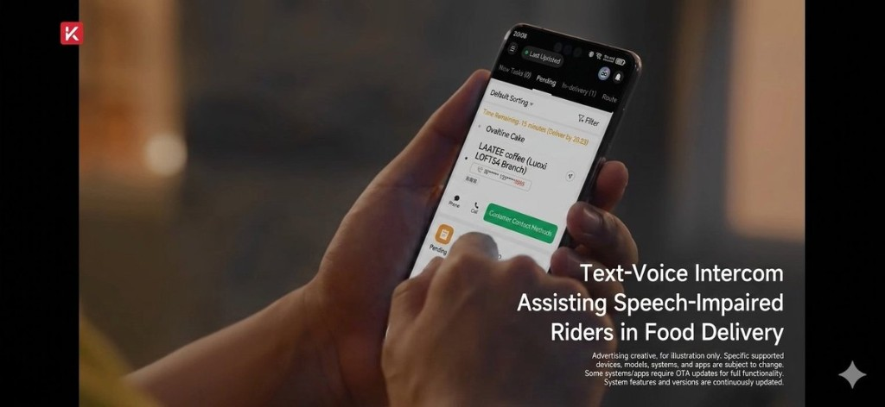
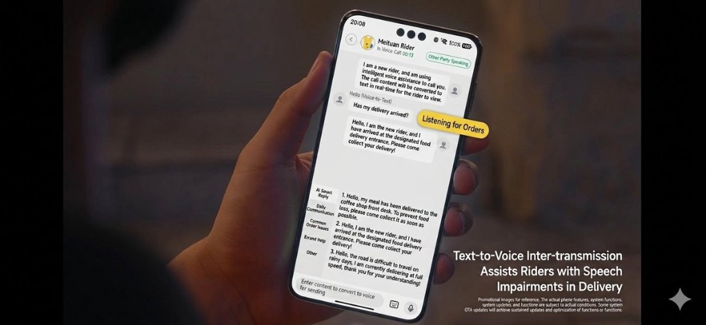

# Tech for Good: How Cangjie Helped Hearing-Impaired Delivery Riders "Hear" Every Order

*A phone call takes about thirty seconds. For a hearing-impaired delivery rider, it might as well be a wall.*

Delivery riders spend their shifts in constant communication: confirming addresses, updating customers on arrival times, resolving last-minute access problems. A quick call handles all of it. But traditional phone communication depends on both hearing and speech, and that dependency has quietly excluded hearing-impaired riders from participating on equal terms.

Meituan Crowdsourcing, one of China's largest gig delivery platforms, built its HarmonyOS app entirely in Cangjie and used that foundation to tackle this problem directly. The result is a complete bidirectional text-to-voice and voice-to-text system that runs on the rider's existing phone, with no additional hardware required.

## How the System Works

The solution is built on five integrated capabilities.

**TTS with call injection.** When a rider types or selects a message in the IM interface, HarmonyOS's TTS engine converts it to synthesised speech and injects it directly into the cellular call's uplink audio channel. The customer hears a natural voice; the rider never needs to speak. Cangjie's multimedia interface layer enables TTS output to bind directly to the call audio stream, avoiding the distortion that comes from the conventional "play through speaker, re-capture by microphone" approach.

**ASR via WriteAudio mode.** When the customer speaks, the system captures their voice through HarmonyOS's `VOICE_DOWNLINK` recording stream and feeds it into an ASR engine using WriteAudio mode. This mode processes audio data without occupying the microphone hardware, so it runs simultaneously with an active call without conflict. The result is real-time transcription of the customer's speech displayed as text in the rider's IM view — something traditional ASR approaches have not been able to achieve during a live call.

**VOICE_DOWNLINK stream capture.** Rather than relying on app-layer recording, the system taps HarmonyOS's native call downlink capability to capture the raw audio stream directly, producing cleaner input for the ASR engine.

**Automated call state management.** The system monitors call state in real time (dialling, connected, ended) and triggers TTS and ASR automatically at the right moments. The rider does not need to manually start or stop anything.

**Quick message templates.** For high-frequency scenarios ("Your order has arrived", "Please collect your food"), a one-tap template system handles the common cases. For more complex situations, the app uses an on-device large model combined with live order status and the current conversation context to generate contextually appropriate messages.

## Why This Matters Beyond the Technology

Accessibility features are often described as additions to a product. This one was built into the foundation. Because the HarmonyOS app was developed entirely in Cangjie, the team had direct access to system-level capabilities: the TTS engine, the accessibility services, the cellular audio stack. The integration is seamless rather than patched on.

The broader point is about participation. Hearing-impaired riders are not a niche edge case to be accommodated. They are workers who want to do their jobs well, without assistance, on equal terms. The difference between a workaround and a real solution is whether the person using it feels like they are making do, or simply getting on with their work.

One detail worth noting for international readers: Cangjie refers to the legendary figure in Chinese tradition credited with inventing written characters, specifically to give language a form that could outlast speech. A programming language named after him is being used here to give speech back to those who cannot use it. The continuity is not accidental.
