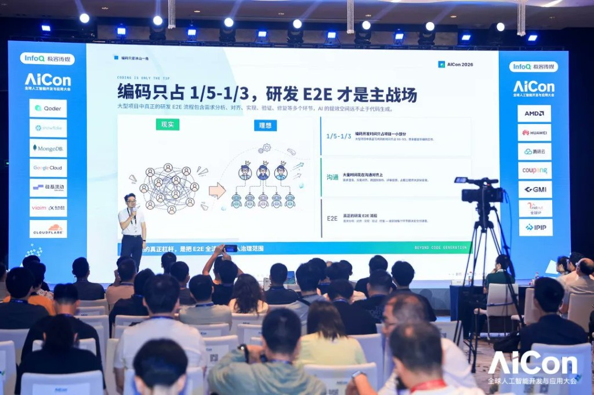
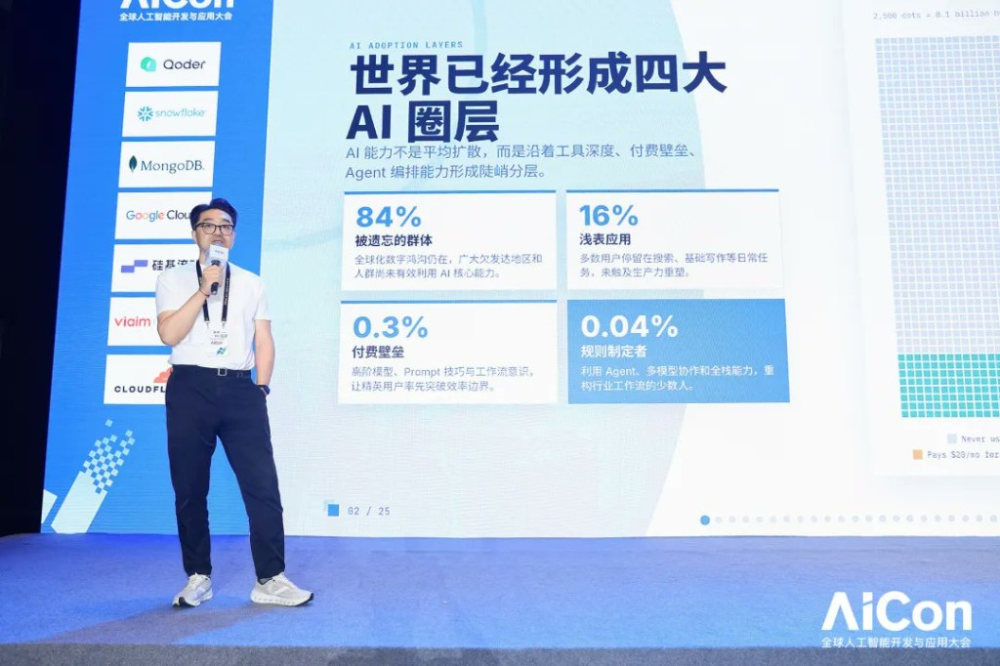

# The Second Half of AI R&D Is Not a Tool Race: Dong Xin on Organisational Evolution at AICon 2026

***"Agents take centre stage. Engineers move up to become directors, scriptwriters, and quality arbiters."***

That line, from Dong Xin at AICon 2026 Shanghai, captures the central argument of his talk: the second half of AI-driven development is not about which tools win. It is about how engineering organisations change.

Dong Xin is Director of Huawei's 2012 Lab Project Group, Huawei's central research division. He has led development of MindStudio (the Ascend AI chip toolchain), DevEco Studio (the HarmonyOS toolchain), and the Cangjie programming language. Since early 2025, his team has been exploring AI agent development at scale, open-sourcing the ACE Harness platform now used by multiple hundred-person R&D teams inside and outside Huawei.

His talk at AICon covered three frameworks — ACE, Human IO Loop, and ATM — and the engineering cases that prove they work in practice.

## The Four Rings and What Separates Them

Dong Xin opened with a breakdown of where the global developer population actually stands with AI. Around 84% have not meaningfully engaged with AI's core capabilities. A further 16% use it for surface tasks without productivity impact. A small group, roughly 0.3%, has crossed the pay wall of advanced models and workflow expertise. And at the very top, 0.04% are genuinely using agents and multi-model collaboration to reshape how industries operate.

The question he posed is not how individuals climb this ladder. It is how entire engineering organisations make the leap from personal efficiency to collective capability.

Three concepts form his answer: **ACE** (Agent Centric Engineering), **Human IO Loop**, and **ATM** (Ability-based Task Matching). Together they address the engineering practice, the governance model, and the organisational structure needed to operate at the top tier.

## The Cangjie Team's Path: From Local Trial to Organisational Capability

Dong Xin used his own team's journey since early 2025 as the concrete reference. The path ran in three stages: local trial, process reshaping, and organisational capability.

Measurable efficiency gains emerged across third-party library development, tool auto-generation, crash stability analysis, technical documentation translation, API testing, and code review. Each started as a point improvement and compounded into a process change. The pattern confirmed that AI-driven development, applied systematically, does not just accelerate individual tasks — it reshapes the surrounding workflow.

## ACE and Human IO Loop: Redefining What Engineers Do

The ACE paradigm positions agents not as assistants but as the primary execution engine across the engineering lifecycle. Engineers shift into three roles: **director** (setting goals and orchestrating flows), **scriptwriter** (defining boundaries and writing specifications), and **quality arbiter** (judging which outputs are trustworthy enough to ship).

To keep autonomous agent execution under control, Dong Xin introduced the **Human IO Loop** methodology, which distinguishes two positions for human involvement. *Human On the Loop* places the human in a governance role, responsible for system-level control. *Human In the Loop* places the human in a judgment role, responsible for result-level trustworthiness. Human attention concentrates on goals, boundaries, risk, and final acceptance. Agents maximise autonomous execution within those constraints.

Two case studies illustrated this in practice.

The first was **compiler memory optimisation**, a high-coupling scenario where traditional refactoring carries significant risk. The team pre-defined objectives, interface boundaries, and the validation environment; the agent then executed autonomously through solution design, implementation, and self-repair; humans set boundaries and accepted results at key checkpoints. A complex system refactor was completed both quickly and under control.

The second was **Hash library performance optimisation**, a knowledge-intensive scenario. The team formed a temporary unit of expert, intern, and agent: the agent handled rapid implementation and benchmarking; the expert directed algorithm strategy and quality arbitration; the intern ran verification and regression. Domain knowledge built up during the process was captured and reused in subsequent tasks, forming a continuously growing knowledge asset. Dong Xin's key point from this case: "Agents can only reliably improve verifiable things." Tests, benchmarks, logs, regression criteria, and review standards define the quality boundary of any agentic system. Without that verification loop, autonomous execution cannot be trusted.

## ACE Harness: From Team Experience to Open-Source Platform

To move from individual agent expertise to a team-governable engineering system, the Cangjie team open-sourced **ACE Harness**. Its core capabilities include specification-driven development, state machine workflow control, a Supervisor module for intelligent routing between agents and humans, adversarial iteration for multi-round quality review, multi-agent deliberation for conflict resolution, Git baseline checkpoints for full traceability, and long-term memory for knowledge accumulation and reuse.

ACE Harness is currently supporting multiple hundred-person R&D teams at Huawei and externally, making it the concrete path from "a team that knows how to use agents" to "an engineering platform that governs agent work at scale."

## ATM: From Fixed Roles to Liquid Organisations

If ACE addresses how agents work effectively, **ATM** (Ability-based Task Matching) addresses how organisations evolve to work alongside them.

ATM connects a task pool, talent pool, and agent pool through capability tags and a priority matching engine. Rather than assigning work through fixed role hierarchies, it dynamically assembles the right people and agents for each task.

One case involved **Ascend operator migration**, which required expertise across Triton operators, AI semantics, compiler IR, and NPU backends simultaneously. Fixed role structures cannot handle that combination. ATM matched the relevant human experts and agents via capability tags and assembled a focused temporary task force.

A second case involved handling **three parallel customer workstreams** in a single week: a feature requirement, a latency gap analysis, and a batch statistics task. ATM's priority queue and dynamic grouping enabled the team to run all three in parallel, removing the scheduling bottleneck that would have serialised them under a traditional model.

Human IO Loop sets the governance boundaries. ATM does the optimal configuration. Together they give an organisation AI's speed without losing human judgment and quality control.

## What Engineers Are For

Dong Xin closed with the question the talk was always building toward: in the AI era, what is an engineer's competitive advantage?

His answer: not coding ability, but the capacity to set goals, define boundaries, orchestrate processes, and arbitrate quality. Agents handle execution. Humans ensure the direction is right and the results can be trusted.

The frameworks presented — ACE, Human IO Loop, ACE Harness, ATM — form a path from individual AI adoption to organisation-level engineering transformation. For the Cangjie team, that path has been live since 2025.
