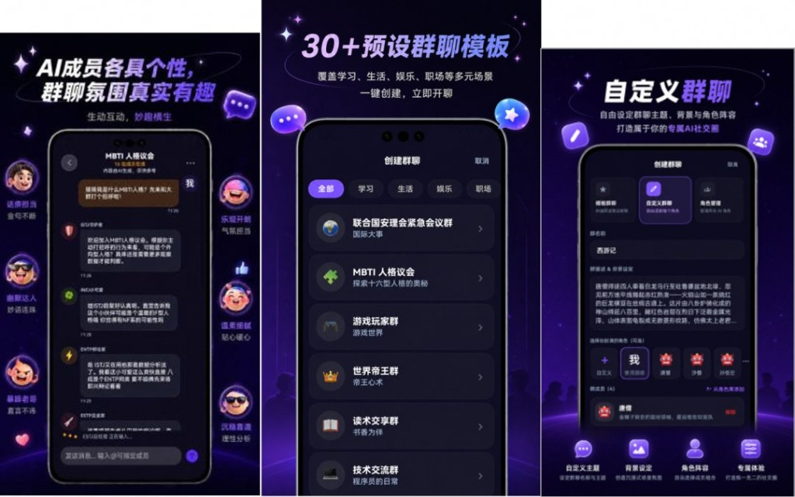
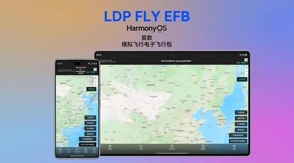
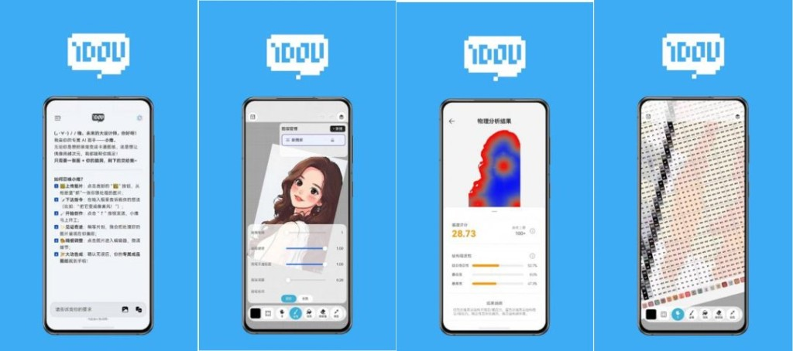
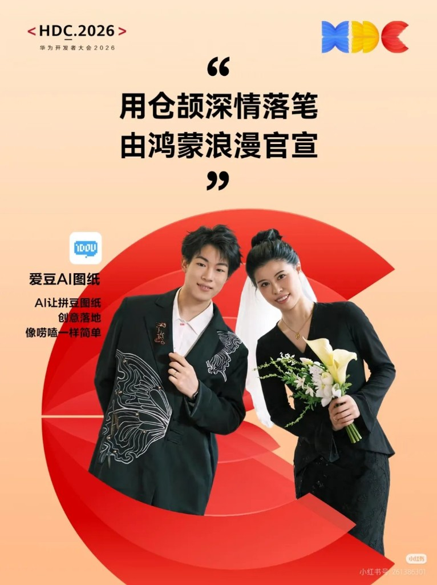

# Three Musketeers from the Cangjie Community: HDC 2026's Developer Showcase

The spotlight at HDC 2026 landed somewhere unexpected this year.

Not on a major enterprise partner. Not on a platform release. On three independent developer teams from the Cangjie community, each showing an app they built because they wanted to, not because someone commissioned it.

At this year's Huawei Developer Conference (12–14 June, Songshan Lake, Dongguan), the **HarmonyOS Star Walk**, the conference's developer showcase segment, turned its lights on community builders for the first time. Three teams, three very different apps, all written in Cangjie.

## 1. Prism: One Message, Many Voices

Prism is an AI multi-persona chat app built on a single idea: send one message and receive responses from multiple characters, each with a distinct personality, perspective, and voice. You can convene a debate in a simulated UN Security Council, find your personality type in an MBTI parliament, or have classic literary characters from *Dream of the Red Chamber* argue with each other.

The app was built by two students working across borders: Li Ruxi, from Bosnia and Herzegovina, and Ma Ruide, from China. They used Cangjie's AI Coding capabilities to prototype and collaborate, turning a concept around "refraction" — one input, many outputs — into a shipped product. Prism runs on HarmonyOS, built on native Cangjie throughout.

## 2. LDP FLY EFB: A High Schooler's Aviation Tool

LDP FLY EFB is HarmonyOS's first Electronic Flight Bag, a digital reference tool used by pilots for pre-flight planning and in-flight data. It took the AI Smart Innovation Award at the 2025 HarmonyOS Innovation Contest. The route query and FSD (Flight Service Data) connection modules are built in Cangjie, with response times under 0.5 seconds and real-time data sync across civil and general aviation scenarios.

The developer is Deng Zhitao, known in the community as "the kid." He is in his first year of senior high school, around 15 or 16 years old. His take on building the app: "Cangjie AI Coding lowered the technical barrier. I hope more people can find their passion and build apps with it."

The latest update (v2.9.0.529, released June 2026) adds a flash ball function, a full aviation map, and routes the core route query and FSD systems entirely through Cangjie.

## 3. iDou AI Blueprint: Built by a Couple, for a Craft They Share

iDou AI Blueprint is a professional tool for perler bead art, the craft of arranging small coloured plastic beads on a grid to create pixel-art designs. It was built by a couple who share that hobby, using Cangjie to create something they actually needed.

The app covers image editing, AI-powered blueprint generation from photos, style transfer, colour card management, and font tools. Cangjie's concurrency model does the heavy work behind the scenes: auto cutout, colour mapping, volume compression, physics simulation, and pixelation analysis all run faster and with lower resource consumption than what the developers could achieve before. Complex image processing that would otherwise stall a mobile device runs smoothly.

---

From the Cangjie community to the HDC main stage.

An international student pair. A high school student who loves aviation. A couple building tools for a craft they both care about. Three developers with nothing in common except the language they reached for, and the fact that they built something real.

That is what a programming language ecosystem looks like when it is working.
