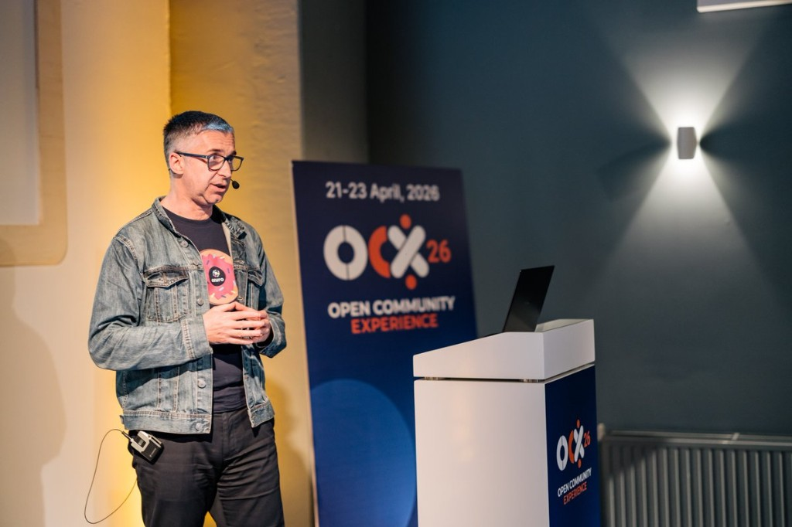

The @EclipseOniro team just shared their #OCX26 recap, and Cangjie gets a highlight!

Dan Ghica and Jarosław Marek's talk on breaking the mobile platform duopoly with Cangjie + Oniro was one of the moments that stood out for the team. Great to be part of an event that brought the open source community together in Brussels.

Read the full recap 👇

[https://blogs.eclipse.org/post/ignacio-ahedo/built-heart-how-ocx26-experience-recharged-oniro-team](https://blogs.eclipse.org/post/ignacio-ahedo/built-heart-how-ocx26-experience-recharged-oniro-team)

